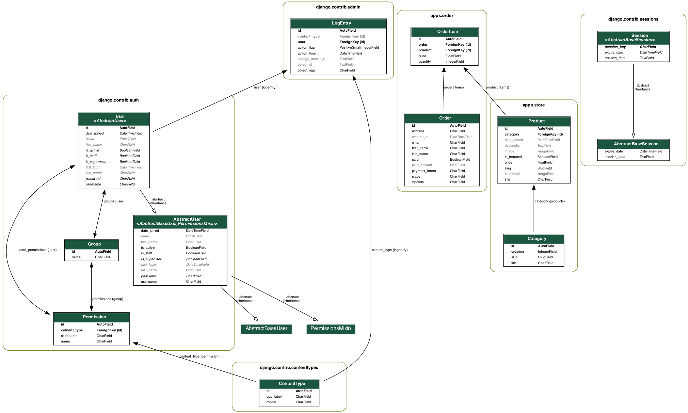

# E Commerce Website bulid with Django
## Description
The website displays products. Users can add and remove products to/from their cart while also specifying the quantity of each item. They can then enter their address and choose Stripe to handle the payment processing.

## Demo

## Development Structure
Backend: Python
Framework: Django
Front-end: HTML, CSS, Javascript(Vue.js), Bulma
Database: db.sqlite3
Payment Intergration: Stripe

- Use Vue.js and Bulma to create an interactive page and cross-platform support.
- Use Django ORM to communicate with the database
- Integrated Stripe payment for checkout

## UML
